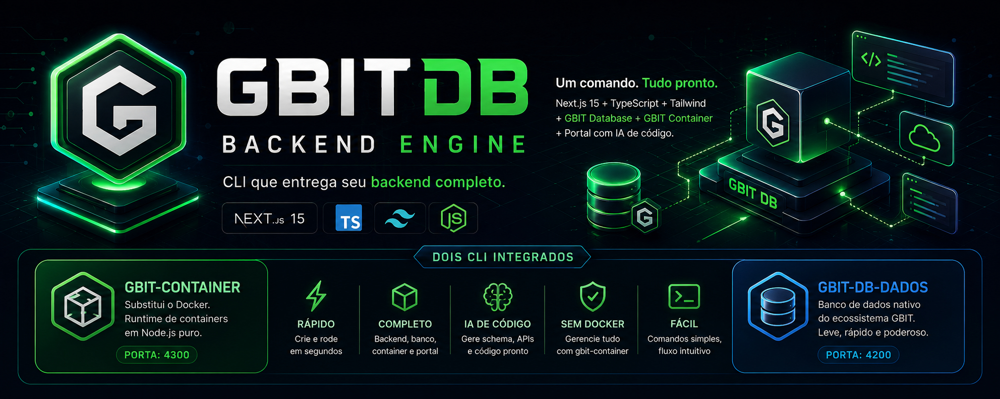
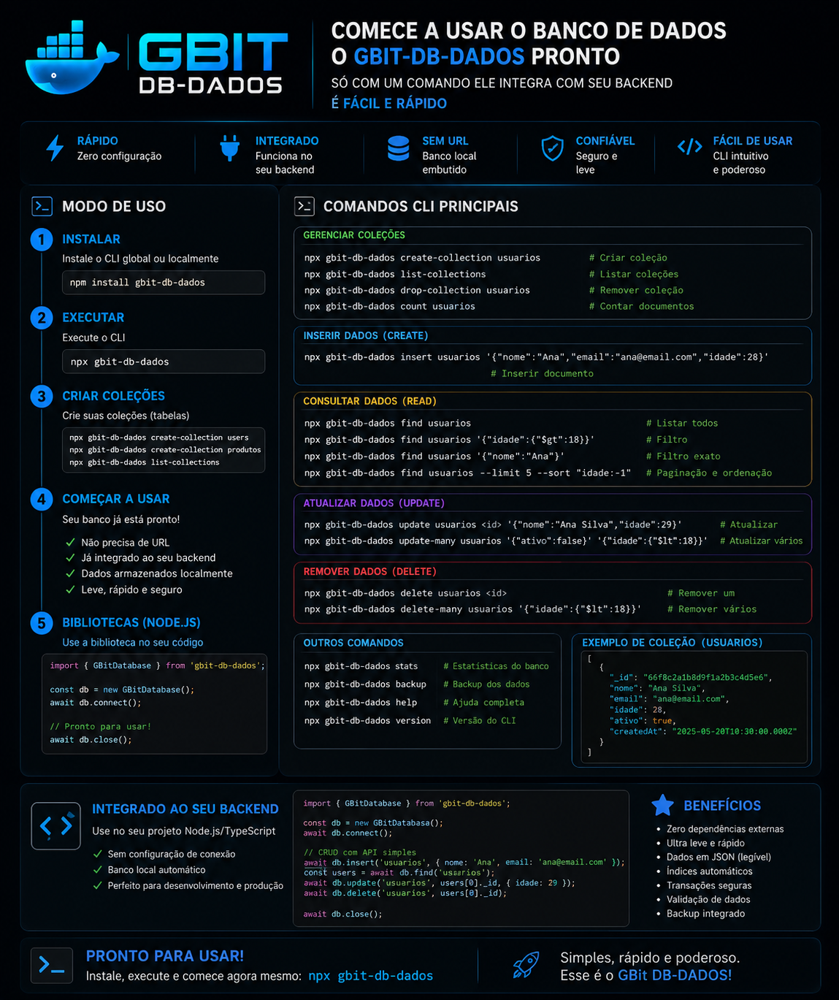

<p align="center">
  
</p>


<p align="center">

  

  

  

  

  

  

  

  

</p>

<p align="center">

  

  

  

  

  

  

</p>

# GBIT DB CLI

<p align="center">
  <strong>
    GBIT DB DADOS · GBIT Container · REST API + CRUD · CLI · AI Codegen · Next.js
  </strong>
</p>


📦 [Pacote no NPM](https://www.npmjs.com/package/gbit-db-cli/gbit-db) · 💻 [Repositório no GitHub](https://github.com/Gislaine-programadora)


Um comando cria um backend completo: **Next.js 15 + TypeScript + Tailwind + gbit-db-dados + GBIT Database + GBIT Container (substitui o Docker) + Portal com IA de código** — em segundos.

```bash
npx gbit-db meu-projeto
```

##  modo de uso : tudo na raiz do projeto;

```bash
npm install 
```

```bash
npm install gbit-db-dados
```

```bash
 npx gbit-db-dados
```


```bash
 gbit-container init
```


```bash
gbit-container stack gbit-db
```


```bash
 gbit-container up
```


```bash
gbit-container dashboard
```


## Nao precisa rodar o projeto  e so copiar a url para o navegador, o gbit-conatiner ja subiu tudo:

	copiar URL para o navegador 

# APP next.js http://localhost:3000/
# gbit-database/gbit-db-dados  http://localhost:4200/
# Portal backend Ai ferramenta  http://localhost:4100/


 É o único passo manual do fluxo — todo o resto sobe sozinho.

## As 4 URLs

| Serviço | Onde rodar | Comando | URL |
|---|---|---|---|
| App Next.js | raiz do projeto | `npm run dev` | http://localhost:3000 |
| GBIT Portal | raiz do projeto | `npm run portal` | http://localhost:4100/portal |
| GBIT Container | raiz do projeto | `gbit-container run --watch` | http://localhost:4300 |
| GBIT Database (gbit-db-dados) | pasta `gbit-database/` | `node server.js` | http://localhost:4200 |

O Portal roda em uma segunda instância Next com `distDir` próprio (`.next-portal`), então app e portal convivem sem conflito de build.

## GBIT Container

Runtime de containers em Node puro, com a ergonomia do Docker:

```bash
gbit-container run           # sobe tudo do gbit-container.json
gbit-container ps            # ID  NAME  STATUS  PORT  PID  UPTIME
gbit-container stop api
gbit-container restart api
gbit-container logs api -f
gbit-container run --watch   # console interativo + dashboard :4300
```

`gbit-container.json`:

```json
{
  "containers": [
    { "name": "app", "port": 3000, "command": "npm run dev" },
    { "name": "portal", "port": 4100, "command": "npm run portal" },
    { "name": "database", "port": 4200, "entry": "gbit-database/server.js" }
  ]
}
```

Estado em `.gbit/containers.json`, logs em `.gbit/logs/<name>.log`.

## Portal (IA de código)

Três abas:

1. **IA de código** — você descreve (`tabela de produtos com nome, preco, estoque, ativo`) e ele devolve, pronto para copiar: schema da coleção para o **gbit-db-dados**, rotas de API (`route.ts`), tipos TS e client de fetch. Motor em `src/lib/codegen.ts`, exposto em `POST /api/portal/ai`. Funciona offline, sem chave de API.
2. **HTTP Client** — testa endpoints do projeto.
3. **Templates** — tabelas prontas.

## Estrutura do CLI

```
bin/gbit-db.js          CLI (create | up | help)
lib/ui.js               banner, spinner, box
lib/create.js           scaffold rápido
lib/terminal.js         abrir terminais separados
templates/
  next-base/            app Next.js pré-configurado
  src/                  páginas, APIs, portal, codegen
  gbit-container/       engine de containers (bin + lib)
  gbit-database/        servidor do banco (server.js + rotas)
  gbit-db-dados/         motor de dados (o pacote publicado no npm)
  scripts/               up.mjs, portal.mjs
```

## Estrutura do projeto gerado

```
meu-projeto/
├── gbit-container/       engine de containers
├── gbit-container.json    configuração dos serviços
├── gbit-database/           servidor do banco (roda em :4200)
├── gbit-db-dados/             dados do banco (coleções, índices, backups)
├── src/                         páginas, APIs, portal
├── scripts/                      up.mjs, portal.mjs
├── next.config.mjs
├── next-env.d.ts
├── postcss.config.mjs
├── tsconfig.json
├── package.json
└── package-lock.json
```

## Banco de dados com Gbit-db-dados integra com seu backend 

<p align="center">
  
</p>

# Autor
# email gislainelophes@gmail.com


