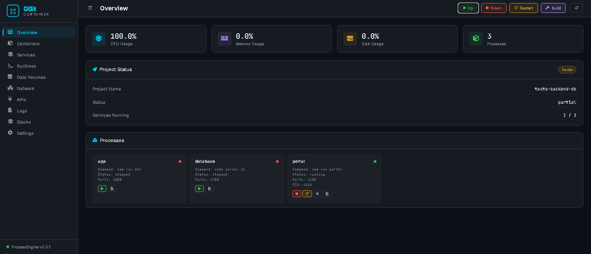

<p align="center">
  
</p>

<p align="center">
  
  
  
  
</p>

<p align="center">
  
  
  
</p>

<h1 align="center">GBIT DB</h1>

<p align="center">
  Um comando gera um <strong>backend completo e pronto pra rodar</strong>:<br>
  Next.js 15 + TypeScript + <strong>gbit-db-dados</strong> (banco de dados) já integrado, na porta <code>4200</code>.
</p>

<p align="center">
  📦 <a href="https://www.npmjs.com/package/gbit-db">Pacote no npm</a> ·
  💻 <a href="https://github.com/Gislaine-programadora">Perfil no GitHub</a>
</p>

```bash
npx gbit-db meu-projeto
```

---
 #  GBIT DB
 
## O que é o GBIT DB

O `gbit-db` não é só um scaffold de Next.js — é uma **engine de backend pronta pra uso**, com o banco de dados já plugado:

- **App Next.js** — frontend + rotas de API, já configurado com TypeScript e Tailwind.
- **GBIT Database** — servidor de backend próprio (Express), rodando na porta `4200`.
- **gbit-db-dados** — o motor de banco de dados, já **integrado ao backend** por dentro do GBIT Database. Você não conecta nada na mão: ele já está funcionando assim que o servidor sobe.
- **Portal** — uma ferramenta com IA de código embutida pra gerar schemas, rotas e tipos a partir de uma descrição em texto.

Tudo isso já vem conectado. O único trabalho que sobra pra você é escolher como **rodar** — e é aí que entra o `gbit-container`.

---

## Fluxo completo (o que importa)

### 1. Gerar o projeto

```bash
npx gbit-db meu-projeto
cd meu-projeto
```

### 2. Instalar as dependências

```bash
npm install
cd gbit-database && npm install && cd ..
```

```bash
pip install -e .
```

### 3. Baixar cli `gbit-db-dados`

```bash
npm install gbit-db-dados
```

### 4. Baixar cli `gbit-db-dados`

```bash
npx gbit-db-dados
```

### 5. Instalar o `gbit-container`

O [`gbit-container`](https://github.com/Gislaine-programadora/gbit-container) é o orquestrador que sobe o App, o Portal e o GBIT Database juntos — sem precisar rodar `npm run dev`, `npm run portal` e o servidor do banco em três terminais separados.

```bash
npm install gbit-container
```

```bash
npx gbit-container
```

### 6. Iniciar com init

```bash
npx gbit-container init
```

### 7. Escolher o stack `gbit-db`

```bash
npx gbit-container stack gbit-db
```

Esse comando gera o `gbit.yml` já configurado pros 3 serviços do projeto — não precisa editar nada.

### 8. Subir tudo

```bash
npx gbit-container up
```

### 9. Abrir o dashboard

```bash
npx gbit-container dashboard
```

## Dashboard do `gbit-container`

<p align="center">
  
</p>s

---

Abre em `http://localhost:7890`. A aba **Network** mostra as portas de cada serviço, com status ao vivo. A aba **APIs** já testa o `/` de cada serviço pra você, sem precisar abrir nada manualmente.

> **Não precisa rodar o projeto na mão.** Depois do `up`, é só copiar a URL do dashboard e colar no navegador — o `gbit-container` já deixou tudo no ar.

---

## As 3 URLs

| Serviço | O que é | Comando por trás | URL |
|---|---|---|---|
| **App** | Frontend Next.js | `npm run dev` | http://localhost:3000 |
| **GBIT Database** | Backend + `gbit-db-dados` integrado | `node server.js` | http://localhost:4200 |
| **Portal** | Ferramenta de endpoints + IA de código | `npm run portal` | http://localhost:4100/portal |

Todas as três já aparecem rodando no dashboard do `gbit-container` assim que você dá `up` — nenhuma precisa ser iniciada por fora.

---

## Portal (IA de código)

O Portal tem três abas:

1. **IA de código** — você descreve o que precisa (ex: `tabela de produtos com nome, preco, estoque, ativo`) e ele gera: o schema da coleção pro `gbit-db-dados`, as rotas de API (`route.ts`), os tipos TypeScript e o client de fetch prontos pra copiar. Funciona offline, sem chave de API.
2. **HTTP Client** — testa os endpoints do projeto direto ali.
3. **Templates** — tabelas prontas pra começar mais rápido.

---

## Estrutura do projeto gerado

```
meu-projeto/
├── src/                    # páginas, rotas de API, portal
├── gbit-database/          # servidor do banco (roda em :4200)
│   └── server.js
├── scripts/                # portal.mjs
├── gbit.yml                # gerado por `gbit-container stack gbit-db`
├── next.config.mjs
├── tsconfig.json
├── package.json
└── package-lock.json
```

---

## Banco de dados: `gbit-db-dados` integrado ao backend

<p align="center">
  
</p>

O `gbit-db-dados` roda dentro do próprio `gbit-database` — não é um serviço separado que você precisa conectar. Assim que o servidor sobe na porta `4200`, o banco já está funcionando.

---


## Autor

**Gislaine** — [gislainelophes@gmail.com](mailto:gislainelophes@gmail.com)

## Licença

MIT


